<p align="center">
  
</p>

<h1 align="center">Karasu</h1>

<p align="center">
  A modern anime &amp; manga tracker — built exclusively for <a href="https://anilist.co">AniList</a>.
</p>

<p align="center">
  <a href="https://github.com/Suzora/Karasu/actions/workflows/release.yml"></a>
  
  
  
  <a href="LICENSE"></a>
  
  <a href="https://discord.gg/yeHNSGyM8F"></a>
</p>

<p align="center">
  <a href="https://suzora.github.io/Karasu/"><b>suzora.github.io/Karasu</b></a>
  &nbsp;·&nbsp;
  <a href="https://github.com/Suzora/Karasu/releases/latest">Download the latest release</a>
</p>

---

## What is Karasu?

Karasu watches your list for you. Play an episode in your video player, read a
chapter in your browser, and Karasu recognizes it and updates your AniList
progress automatically — no buttons to press. It lives in your system tray
where your desktop has one,
speaks English and German, and is built as a small native app with Tauri, React
and Rust — for Windows, Linux and, as a sideloaded APK, Android, where the same
app trades the tray for a bottom navigation bar.

It's inspired by the wonderful [Taiga](https://github.com/erengy/taiga).

## Why use it over the website?

Because a local app can do things anilist.co simply can't:

- **It knows what you're actually watching.** Local players and browser tabs are
  detected and scrobbled for you.
- **It plays your files.** Point it at your anime folder and launch the next
  unwatched episode with one click, straight from your list.
- **It keeps you in the loop.** Desktop notifications and a bundled notification
  centre for new episodes, announced sequels, and titles you've left on hold.
- **It shows up on Discord.** Optional Rich Presence that reflects what you're
  doing — and still says so when nothing is playing.
- **It works without an account, too.** A fully local list on your device —
  editing, statistics, export and import all work offline — with a one-time
  merge into AniList whenever you decide to connect. Two things do need an
  account, because they have nothing to match against without one: automatic
  scrobbling and the local library scan.

## Screenshots

Captures of 1.32 at 1440×900 on the desktop and straight off the phone — the
same set the [website](https://suzora.github.io/Karasu/) shows at full size.

<p align="center">
  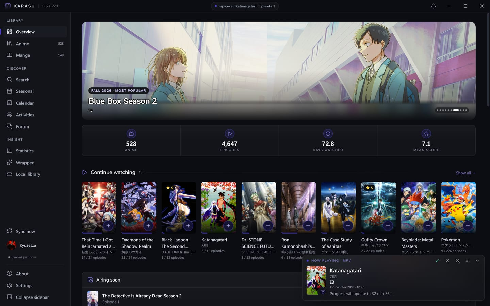<br />
  <sub>Now Playing — an episode detected in mpv, the update counting down; update now, skip it, or fix the match</sub>
</p>

<table>
<tr>
<td width="50%">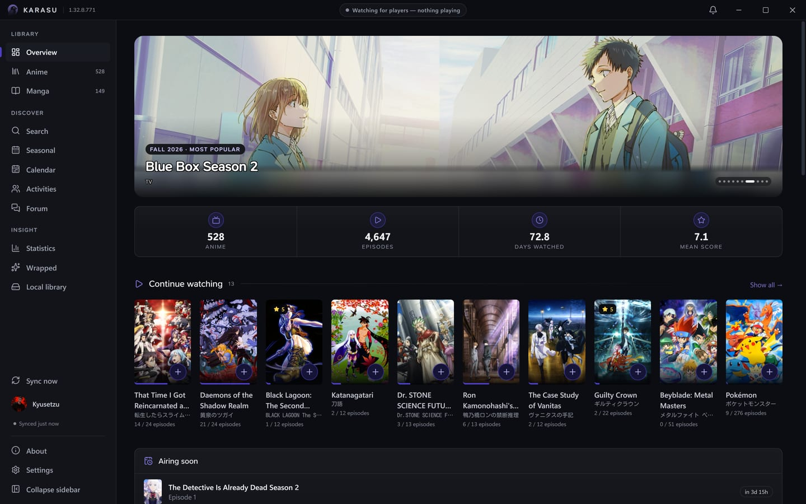<br /><sub>Overview — the season's headline title, your numbers, what to watch next and what airs soon</sub></td>
<td width="50%">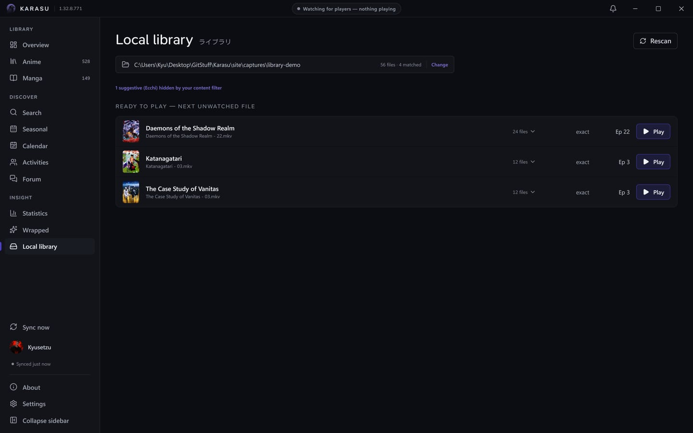<br /><sub>Local library — your files, matched to your list, next unwatched episode first</sub></td>
</tr>
<tr>
<td width="50%">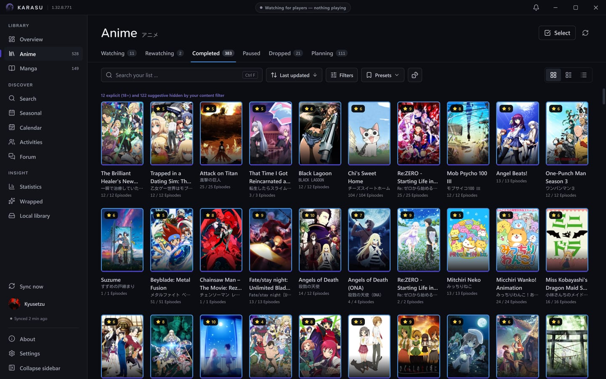<br /><sub>Anime list — covers, status tabs, filters and presets</sub></td>
<td width="50%">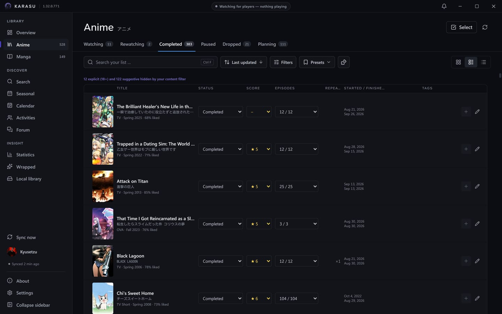<br /><sub>…or as rows, with status, score and progress edited in place</sub></td>
</tr>
<tr>
<td width="50%">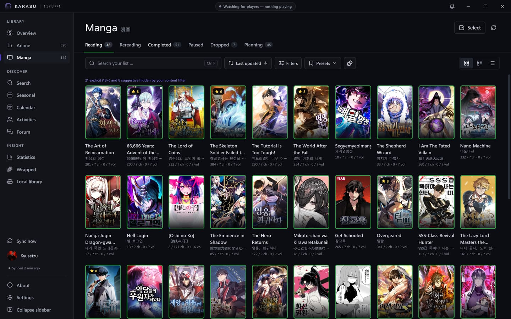<br /><sub>Manga list — the same list, counting chapters and volumes</sub></td>
<td width="50%">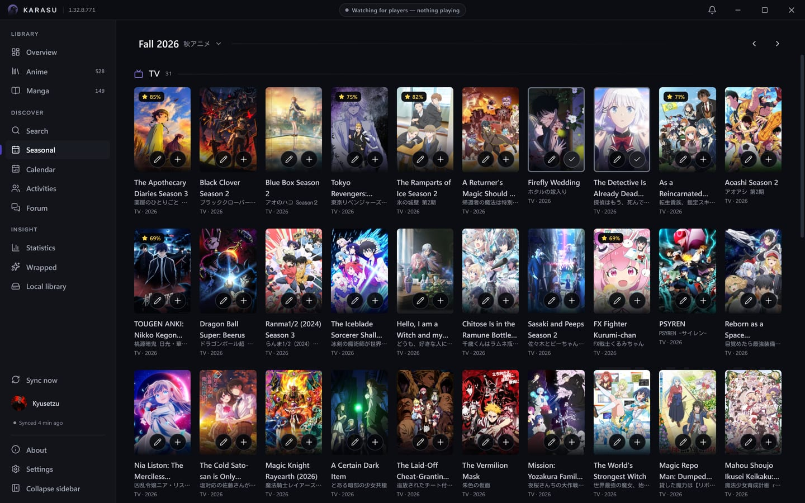<br /><sub>Seasonal — one season's grid, any season of the last four years two clicks away</sub></td>
</tr>
<tr>
<td width="50%">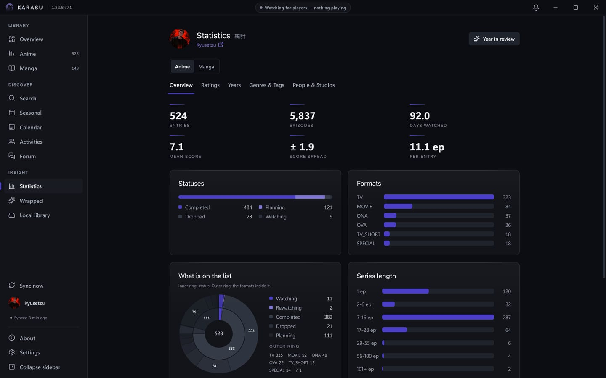<br /><sub>Statistics — how your list splits by status, format and length</sub></td>
<td width="50%">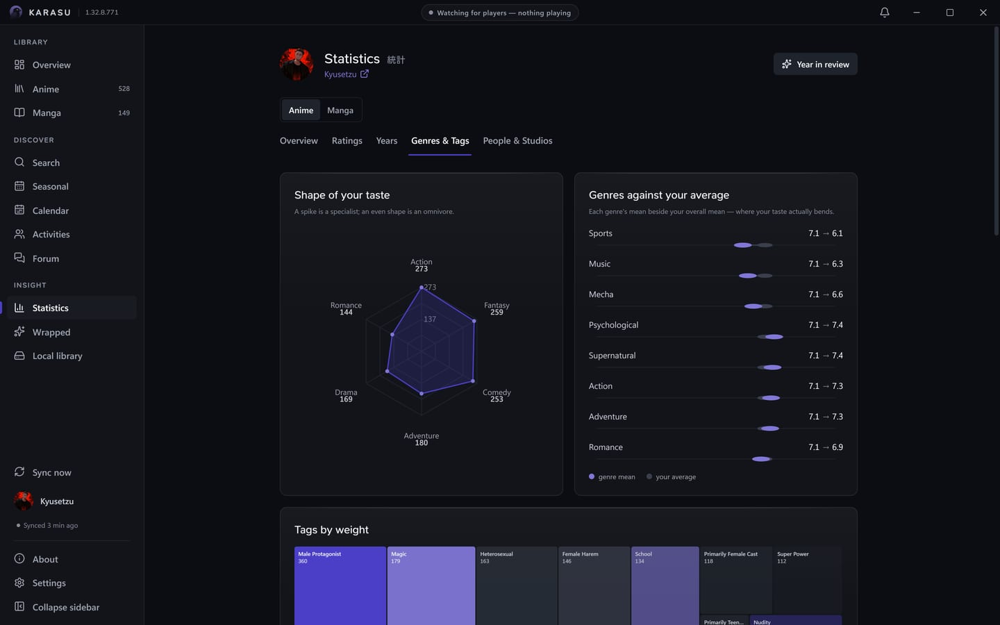<br /><sub>…and the shape of your taste: genres against your average, tags by weight</sub></td>
</tr>
<tr>
<td width="50%">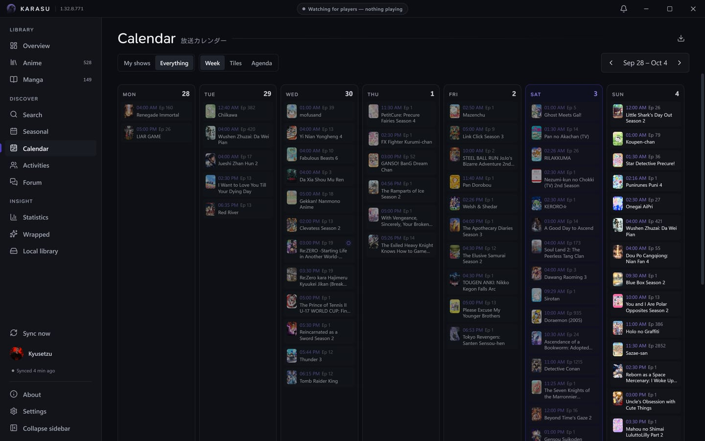<br /><sub>Calendar — the week as a grid, tiles or an agenda, your shows or everything, with iCal export</sub></td>
<td width="50%">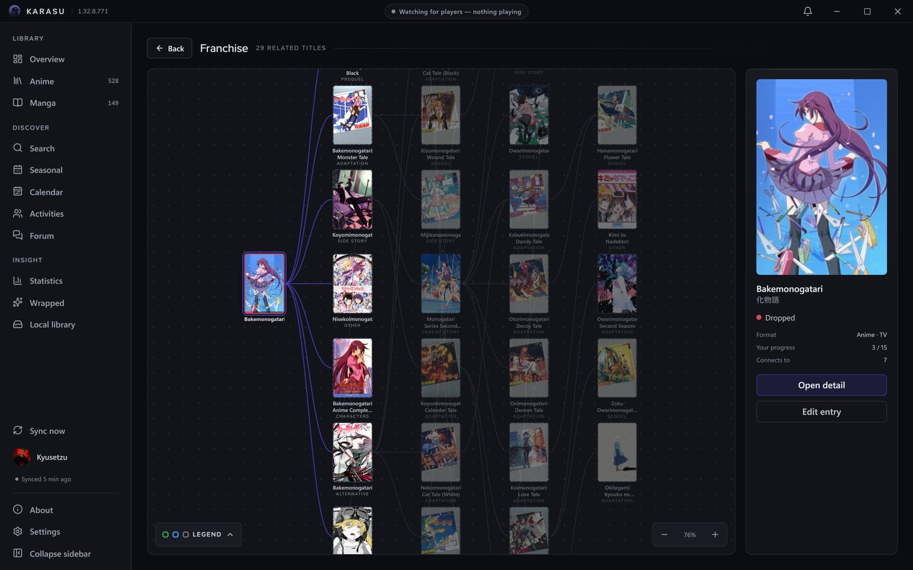<br /><sub>Franchise — the whole relation map, each node coloured by your status</sub></td>
</tr>
</table>

<p align="center">
  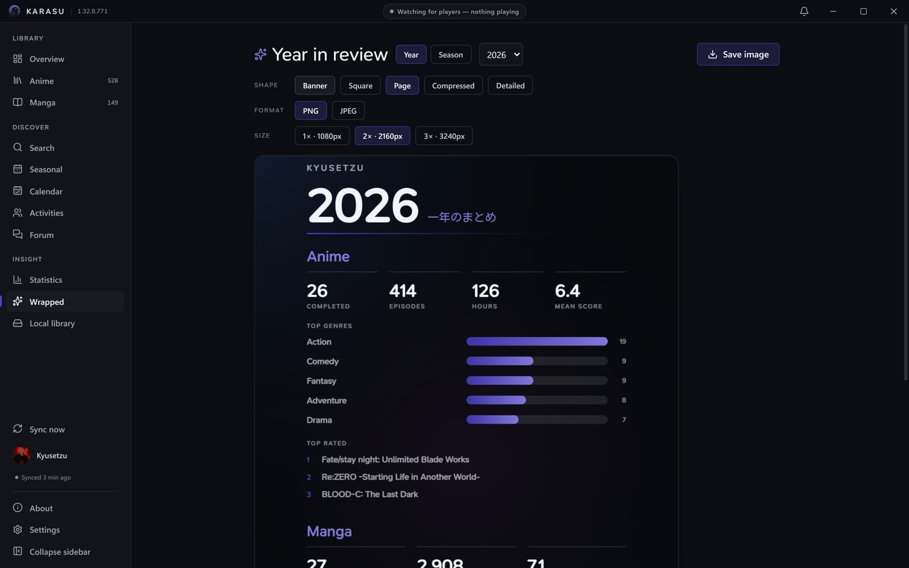<br />
  <sub>Year in review — a shareable poster of your year or a season, in five shapes</sub>
</p>

<table>
<tr>
<td width="33%">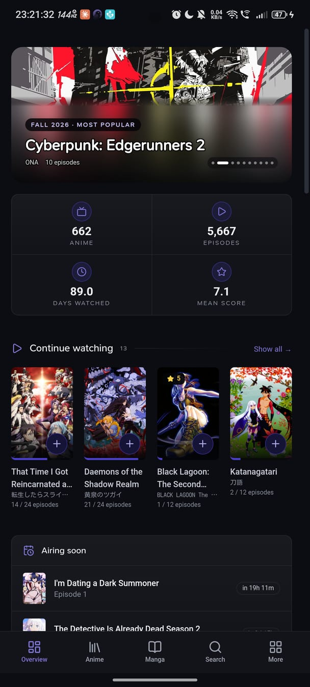</td>
<td width="33%">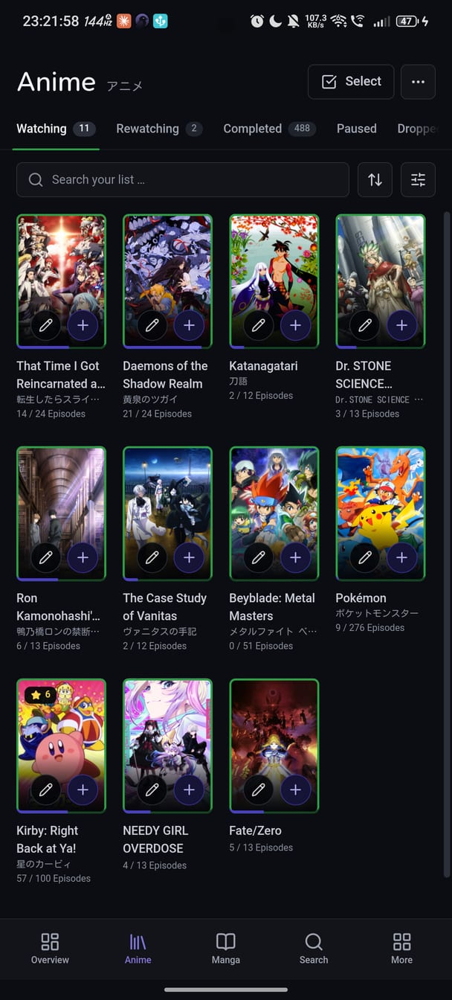</td>
<td width="33%">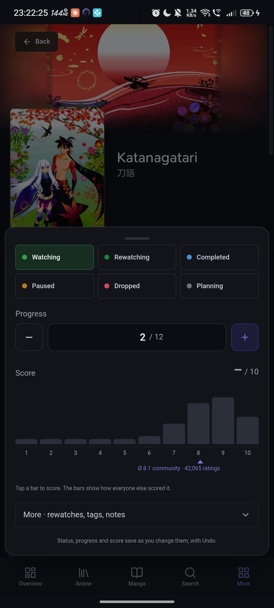</td>
</tr>
<tr>
<td colspan="3" align="center"><sub>Android — the same list, statistics and social pages, with a bottom bar instead of a tray</sub></td>
</tr>
</table>

## Features

**Tracking &amp; scrobbling**
- Automatic detection in local players (mpv, VLC, MPC-HC/BE, PotPlayer, SMPlayer)
  and in the browser (Crunchyroll, ADN, Netflix); a paused player is read from
  its audio session, so a pause defers the update rather than faking a watch
- An opt-in **mpv IPC** source — point Karasu at mpv's JSON IPC socket and it
  reads the real file path and the live position instead of a window title
- Manga reading detection (MangaDex, MANGA Plus, Comick, Bato, MangaFire, Asura Scans)
- **Media-session detection** (SMTC on Windows, MPRIS on Linux) for players
  that report to the system media controls instead of writing the title into
  their window — Jellyfin Media Player, Plex and browser video
- **Jellyfin server integration** (optional) — ask your server instead of
  guessing from a window title, and it reports the series, season and episode
  as exact fields rather than a filename to parse. Sign in with your ordinary
  Jellyfin account (no administrator rights, no API key); the server then only
  ever reports your own playback, so nobody else on a shared server ends up on
  your list. Your password is exchanged once for an access token and never
  stored. On Android this is the whole of detection — a phone shows no window
  titles and hands out no media sessions
- The Jellyfin pane **finds the servers on your network by name**, the way
  Jellyfin's own clients do, and checks that an address really is a
  Jellyfin server before your password is sent anywhere. An optional
  **second, external address** takes over when the first is out of reach —
  a phone away from home — and only once it has answered as the same
  server, so the token never travels to a stranger
- **Two Karasus, one write.** The PC and the phone signed in as the same
  Jellyfin user see the same playback; the desktop goes first, the phone
  waits, and both ask AniList for the live progress right before writing, so
  an episode lands once
- On Android an opt-in **foreground service** keeps Jellyfin tracking alive
  with the screen off, and the settings hint names the vendor rule that
  actually matters where a ROM freezes background apps anyway
- Automatic scrobbling after a configurable threshold, with optional
  confirmation, episode-gap protection and
  [anime-relations](https://github.com/erengy/anime-relations) episode redirects
- The **Now Playing window** floats over every screen: the cover, the title
  with its native line, season and episode (`S2 · E5`) or chapter with the
  episode's own name where the source knows it, the AniList line (format,
  season, length), the countdown ring and the three verbs — update now, skip,
  fix the match — in its header. On desktop it drags anywhere by that header,
  resizes by its edges and remembers both; on the phone it docks above the
  bottom bar; a chevron collapses it to one line

**Lists &amp; editing**
- Anime and manga lists with status tabs, grid/list views and an **offline queue**
  that syncs once you're back online — inspectable in Settings down to the
  single queued edit, each one discardable, with a sync button beside it
- Taiga-style quick editing (progress/score dropdowns, +1, one-click *Completed*)
  and a shared edit dialog straight from search results
- A **default status for new adds** — decide once, in settings, what *Add to
  list* means, instead of answering per title
- **Bulk multi-select** edits, saved **filter/sort presets**, a **random pick**,
  private **notes**, custom **tags** (with a tag filter), and a
  **rewatch/reread counter**
- Manga counts **chapters and volumes** as two separate axes, the way AniList
  stores them
- Scores read and write in **your account's own format** — 100-point, 10-point
  (with or without decimals), 5 stars or 3 smileys — and every control,
  badge and chart follows when you change it
- Every edit can be **undone** from the toast it raises — and a failed write
  says so, queues itself and offers a retry
- **Frugal with AniList's rate limit.** Your list is read from the local
  copy for fifteen minutes after a fetch and refreshed quietly behind it after
  that; details, seasons, franchises and recommendations are cached on disk
  and survive a restart; the airing check wakes for the next episode instead
  of polling. *Sync now* still fetches at once, and the sync panel shows every
  request by what spent it

**Discovery**
- Search with an anime/manga toggle, seasonal charts, rich detail pages —
  and a **fullscreen cover viewer** on every detail page, with pinch zoom
- Search scopes for **users, characters, staff and studios** too. These ask
  for three characters before firing — below that AniList answers with
  noise, measured rather than assumed
- **Typo-tolerant local search** — your own lists and the command palette
  match with per-title trigram scoring, so a misspelled title still finds
  its show
- **Person, character and studio pages** — voice actors, staff and studios each
  get a page of their own, with their roles and works, reachable from any
  detail page or statistic
- **Airing calendar** — Monday-first, in whichever shape fits: a real week
  grid, a tiled overview or a running agenda, with two lenses on each (just
  your shows, instant and offline, or the complete schedule). Episodes that
  have already aired stay in view, greyed once you have watched them, so a
  week reads as what happened as well as what is coming. The week grid needs
  980 px; narrower than that, or on a phone, the agenda takes over
- **Recommendations** for anime and manga on the dashboard, built from the
  titles you've completed — the higher you scored something, the more its
  suggestions count, and anything already on your list is left out
- The dashboard's continue-watching strip has a **continue-reading twin** for
  manga, chapter +1 right on the card
- **Franchise graph** — the whole franchise as a relation map (sequels, side
  stories, cross-medium sources/adaptations), each node coloured by your status,
  pan and zoom, double-click to open a title

**Activities**
- **Profiles** — yours and anyone's: bio, banner, favourites, statistics and
  their lists, with follow/unfollow, a follower browser, and a forum tab that
  opens on their comment history
- **Activity feeds** — what the people you follow watched, read, posted and
  replied to, with likes, replies and a status composer of your own. Activity
  permalinks open in-app: a link to a post lands on the post
- **Forum** — browse and read AniList's forums, follow comment threads, and
  start threads or reply from inside the app. Comment permalinks land **on the
  comment**, highlighted — even in threads deeper than AniList's own
  5,000-entry paging cap, which Karasu routes around via the uncapped
  comment tree
- Every composer — status, reply, thread, comment, review, bio — has a
  **formatting toolbar** for AniList's markdown (bold, spoiler, headings,
  lists, links, images, YouTube, centre) and a preview, and renders
  posts the way anilist.co does
- All of it is AniList's own data, fetched live — Karasu stores none of it

**Insights**
- **Statistics in five themed tabs** — overview, ratings, years, genres &amp;
  tags, people &amp; studios — drawn with a sunburst, radar, treemap, area
  charts, gradient bars, dot plots and an activity heatmap
- **Your scores against the crowd's** — mean deltas and the titles you disagree
  on hardest, computed from the list you already have, at zero request cost
- **Year in review** — a shareable poster of your year, or of a single
  season, in five crops (banner, square, page, compressed, detailed),
  exported as PNG or JPEG at 1×, 2× or 3×
- Time-to-finish estimates and a Dashboard "this week" digest

**Notifications**
- New-episode desktop toasts, opt-in **sequel-announcement** alerts and
  **on-hold reminders**; a show you watch but don't want pinged about can be
  **muted** from its context menu, and Settings lists the muted ones
- An opt-in **background check for your AniList notifications** — off by
  default, with 15/30/60-minute presets or your own interval. On desktop it
  runs while Karasu sits in the tray; on Android it runs even with the app
  closed. The notification names the newest one — who did what, never what
  anyone wrote, and no title your content filter hides — and opens the bell
- A bundled in-app **notification centre** — the bell in the title bar on
  desktop, in the bottom bar's More area on the phone — with read /
  mark-all-read. Karasu's own alerts and your AniList notifications arrive
  as **one merged stream**, and bursts collapse: one person liking five
  posts is one row, and so are consecutive airings of the same series
- A notification row opens the thing it is about — an activity notification
  lands on the activity itself, the actor's name on their profile — and
  **says which one**: the list entry with its cover, the post or the forum
  comment, spoilers named rather than shown and nothing past your content
  filter

**Integrations &amp; flexibility**
- **Local library** — your folder scanned and matched to your list, each title
  showing the next unwatched file and how confident the match was, with every
  episode on disk one click away
- **Season splitting** — a folder that holds more episodes than its show is
  flagged, and a guided dialog re-points the overflow at the right season
  (community rules pre-select the likely answer, you always confirm); splits
  persist, chain, and can be corrected
- Titles the matcher can't place get **AniList's best guess** to confirm with
  one click, or a search to answer by hand
- **Discord Rich Presence**, optional, with an idle state and a link back to
  the project
- **Local-only mode** (no account needed) with a later sign-in merge
- **Portable mode** — keep everything in a folder next to the executable

**Personalisation**
- Light / dark themes and a full **accent colour picker** — every shade and
  the readable ink on top are derived from the one colour you pick, so nothing
  is hardcoded
- **Covers per row** as a typed number, 1–40, previewed live as you type —
  and a **reduce motion** switch
- **Interface size** — zooms the whole window in eight steps from 75% to 200%,
  on <kbd>Ctrl</kbd>+<kbd>+</kbd>, <kbd>Ctrl</kbd>+<kbd>-</kbd> and
  <kbd>Ctrl</kbd>+<kbd>0</kbd> as well as in Settings, for a 4K display or a TV
  across the room. On a short window the sidebar collapses to its icon rail
  by itself, so nothing drops off the bottom
- **Density** — compact, comfortable or spacious for the screens that crowd:
  the calendar and the local library. Everything else keeps its size
- **Title language** — English, Romaji or the original, per device, for every
  title Karasu shows: lists, detail pages, notifications, the tray, the
  Android widgets and the Discord status. A title without that version falls
  back to the next one
- A **content filter** for adult and suggestive titles, with a disclosure
  line wherever it hides something — explicit (18+) and suggestive (Ecchi)
  counted separately, linking straight to the setting
- **Keyboard shortcuts** throughout, with a <kbd>?</kbd> reference sheet: a
  command palette on <kbd>Ctrl</kbd>+<kbd>K</kbd>, <kbd>/</kbd> to search,
  <kbd>Ctrl</kbd>+<kbd>1</kbd>–<kbd>3</kbd> between screens, and arrows,
  <kbd>Space</kbd>, <kbd>E</kbd> and <kbd>C</kbd> inside a list
- **Settings in seven panes** — account, appearance, detection, library,
  desktop, import & export, and a marked-dangerous advanced pane. The account
  pane holds both halves: what stays in Karasu, and, under *Kept on AniList*,
  your *account's* own settings edited in place — title language, score
  format, activity posting, AniList's own notification toggles — so they
  apply on anilist.co and in every client at once. On Android the library
  and desktop panes are hidden, because nothing behind them exists there
- **One interaction model, three presentations**: right-click on a title
  opens a context menu, a long press on the phone opens the same actions as
  a bottom sheet, and the command palette lists them too — update progress,
  change status or score, open, fix a detection, all resolved from one list
  that only offers what would actually change something
- On the phone: **pull a list down to sync**, and **swipe up from the
  bottom bar** for the command palette
- System tray, single instance, autostart, and a global hotkey that shows or
  hides the window
- **Daily local backups** of the database (one per day, the newest kept) —
  what the app restores from by itself when the file will not open
- English / German with automatic system-language detection
- One-click AniList login and a built-in *Check for updates* — on Android
  the app downloads the APK for your device over Wi-Fi, verifies it, and opens
  the system installer when you tap

## Installation

Download from the
[releases page](https://github.com/Suzora/Karasu/releases) — or from the
[website](https://suzora.github.io/Karasu/#platforms), which carries the
same files with each platform's notes beside its button. Each release
carries one build per platform, always the newest: the Windows installer
(`Karasu_<version>_x64-setup.exe`), the Linux `.AppImage`, `.deb` and `.rpm`, and two Android
APKs (`Karasu_<version>_arm64.apk`, plus a `_universal` fallback) — alongside
`SHA256SUMS.txt` and `latest.json`, the manifest every updater reads — the
desktop plugin its own key, Android the APK legs.

Two releases sit on that page. **Karasu <version>** is the Stable channel and
the one to take; **Nightly build** is the rolling per-commit build for anyone
who wants to stay on the edge. The built-in updater follows Stable on a fresh
install; the channel is chosen under **Settings → Desktop → Updates** (on
Android, under **Settings → Account**, where the desktop pane does not exist).

On first start, open **Settings → Log in with AniList** — your browser opens
AniList, you approve access, and Karasu logs you in automatically. (A manual
token paste is available as a fallback.) On Android the way back is one tap:
the page you land on after approving shows a **Return to Karasu** button — a
`karasu://` link — that brings the app forward. You can also pick **Use
without an account** to track locally and connect later.

On Windows it installs for the current user only — into `%LOCALAPPDATA%`,
with no UAC prompt and nothing written outside your own profile.

> **Upgrading over an existing install.** Run the installer with `/UPDATE` and
> it skips the "uninstall the existing version or keep it" page and simply
> replaces what is there:
>
> ```
> Karasu_<version>_x64-setup.exe /UPDATE
> ```
>
> Add `/P` for a passive run, which also skips the Welcome and Finish pages and
> shows only a progress bar. Karasu's own updater already passes `/P /R /UPDATE`,
> so **none of this applies to an in-app update** — it is only worth knowing
> when you have downloaded a `setup.exe` and are running it by hand.

> **About the SmartScreen warning.** The installer is **unsigned** — Karasu
> is a small solo-maintained project, and a Windows code-signing certificate
> costs money that doesn't currently make sense here. On first run, Windows
> SmartScreen may show a "Windows protected your PC" prompt (**More info →
> Run anyway** to continue). If you want to verify the download before
> running it, every release ships a `SHA256SUMS.txt` checksum and a
> [VirusTotal](https://www.virustotal.com) scan result linked right in its
> release notes. Karasu's own built-in updater (Settings, or the About page)
> independently verifies every update it installs against its own signing
> key, regardless of SmartScreen.

> **Platforms.** Windows and Linux, both x86_64, and Android as a sideloaded
> APK.
>
> Linux ships three ways: an **AppImage** — one file for Ubuntu, Debian and
> Arch alike, and the one the in-app updater replaces — plus a **`.deb`** and an
> **`.rpm`** for the package manager, which update with the next release rather
> than in-app. All are built on Ubuntu 22.04, so they need **glibc ≥ 2.35**.
> The AppImage carries its own WebKitGTK and GTK and takes only the display
> libraries (Mesa, X11, Wayland) from the system; the `.deb` and `.rpm` use the
> system's **webkit2gtk-4.1** (`libwebkit2gtk-4.1-0` on Ubuntu/Debian,
> `webkit2gtk4.1` on Fedora) and pull it in as a dependency. A tray icon needs a
> StatusNotifier host — on GNOME, the AppIndicator extension — and without one
> Karasu still runs, but closing the window quits instead of hiding it.
>
> On systems with Mesa 26 (Fedora 44, Ubuntu 26.04) an AppImage up to
> 1.19.1.664 shows a black window and prints `Could not create default EGL
> display: EGL_BAD_PARAMETER`, and 1.19.2.665 can crash with a segmentation
> fault shortly after opening. Both come from libraries the AppImage bundled
> from Ubuntu 22.04; later builds leave the display libraries to the system and
> keep GTK's Wayland input-method module out of an X11 session. For an older file,
> take the `.rpm` or `.deb`, or download the current AppImage by hand, since
> the in-app updater cannot run in an app that does not start.
>
> Like the `.deb` and the `.rpm`, the AppImage runs natively on Wayland in a
> Wayland session and on X11 everywhere else. `GDK_BACKEND=x11
> ./Karasu_*.AppImage` runs it through XWayland instead, which is the first thing
> to try if the window stays blank or crashes under Wayland. Two things behave
> differently on Wayland by its design: the window comes back at its last size
> but not its last position, and the summon shortcut only fires while an X11
> window has focus.
>
> Android ships as two APKs — take `Karasu_<version>_arm64.apk`, and fall
> back to `_universal` only if your device refuses it (releases carry it;
> a Nightly is arm64 alone). Both are
> release-signed by CI with the same key every time, which is what lets a
> newer version install straight over the older one with your data intact.
> From 1.11 the app updates itself: it downloads the APK for your device
> over Wi-Fi (mobile data is a switch), checks its sha256 against the
> release manifest and its signing certificate against the installed app's,
> and opens the installer when you tap — from
> About, from the bell, or once at start. Android asks once for the
> "install unknown apps" permission for Karasu; that switch is the consent. The phone gets its own shell — keyed on width (767px),
> not on the device, so a narrow enough window gets it anywhere: navigation
> moves to a bottom bar, the back gesture closes whatever is open instead
> of leaving the page, and system notifications ask for their runtime
> permission before the first one is sent. Four home-screen widgets —
> Airing Today, Continue Watching, Continue Reading and a weekly airing
> calendar — render straight from the cached list, no network needed; and
> sharing an anilist.co link from any browser opens it in Karasu. Sharing is
> the supported route on purpose: making Karasu open anilist.co links
> *directly* would need Android to verify the domain against a file hosted on
> anilist.co, which is not ours to put there. If you want tapping a link to
> land in Karasu anyway, Android will let you say so by hand — **Settings →
> Apps → Karasu → Open by default → Add link** — and the share sheet needs
> none of that.
>
> Detection differs. Window titles are read on Windows only: there is no
> X11/Wayland enumerator, and under Wayland one application cannot read
> another's windows at all. On Linux the sources are **MPRIS** — which covers
> mpv (with the `mpv-mpris` plugin), VLC, SMPlayer and browser video — plus the
> optional Jellyfin server. Manga sites, which publish no MPRIS, are not
> detected there. On Android the answer is shorter still: Jellyfin is the
> whole of detection; the desktop *sources* sit greyed out under a "desktop
> only" badge rather than pretending to work, while the tracking settings —
> threshold, confirmation, automatic updates — are live, since the phone
> writes with them.

## Development

Prerequisites: [Node.js](https://nodejs.org) 22 (what CI runs), [Rust](https://rustup.rs)
(MSVC toolchain on Windows), VS Build Tools with the C++ workload, WebView2
(included in Windows 11). On Ubuntu, install `libwebkit2gtk-4.1-dev`,
`libgtk-3-dev`, `libayatana-appindicator3-dev`, `librsvg2-dev`,
`libglib2.0-dev`, `libdbus-1-dev`, `patchelf` and `file` — the same list
`.github/workflows/ci.yml` installs, so the two cannot drift. Android builds
additionally need JDK 17 (Temurin), the Android SDK (platform 36, build-tools
36 and 35) and NDK 27.1.12297006.

```sh
npm install
npm run tauri dev                # development build with hot reload
npm run tauri build              # release build (NSIS on Windows; AppImage, deb and rpm on Linux)
npx tauri android build --apk    # Android release APK

npm run verify       # the commit gate: typecheck, audits and lints, then vitest and cargo test together
npm run verify:full  # the push gate: the commit gate plus knip, clippy, cargo-deny, machete, the site, the bundle budget, the Android check, a bundle
npm run lint         # oxlint: react-hooks, a11y, imports, vitest rules; part of verify
npm run typecheck    # TypeScript alone
npm test             # frontend unit tests (vitest) alone; test:watch, test:node, test:dom, test:changed narrow it
cargo test --manifest-path src-tauri/Cargo.toml   # backend tests alone
scripts/android-check.ps1   # fast cfg(mobile) compile gate — the checks above build none of the Android-only Rust
```

**Versioning.** Every commit bumps a four-part version
`MAJOR.MINOR.PATCH.COMMIT#` (breaking / feature / fix / commit counter); the
running version is shown in the About window.

Contributions are welcome — [CONTRIBUTING.md](CONTRIBUTING.md) has the commit
loop (which is mandatory), where code goes, and the list of things that are
refused on purpose so nobody builds one by accident.
[CHANGELOG.md](CHANGELOG.md) is the short version of what has landed, and
[ROADMAP.md](ROADMAP.md) is the honest version of what might come next — what
each idea would actually cost, rather than a list of promises.

The website is its own npm project under [`site/`](site/README.md), deployed
to GitHub Pages by `.github/workflows/pages.yml`. Nothing in it is imported by
the app, a site-only commit builds no Nightly, and every claim on the page has
a row in [`site/CONTENT-AUDIT.md`](site/CONTENT-AUDIT.md) naming the code that
makes it true.

### Architecture

| Layer | Technology |
|---|---|
| Shell | Tauri 2 (Rust backend; WebView2 on Windows, WebKitGTK on Linux, the system WebView on Android) |
| Frontend | React 19 + TypeScript + Vite + Tailwind CSS v4 |
| State | TanStack Query (server), Zustand (client), i18next (i18n) |
| Rendering | `@tanstack/react-virtual` for the anime and manga lists, so a several-thousand-entry list only mounts the rows near the viewport |
| Storage | SQLite via rusqlite (cache, offline queue, local list, notifications, settings) on every platform; tokens in the OS credential store on desktop (Windows Credential Manager, Secret Service on Linux) and, on Android, in a file sealed by the Android Keystore — AES-256-GCM, with a key that never leaves the Keystore. In portable mode the token is a file instead, encrypted with DPAPI on Windows and XChaCha20-Poly1305 under a Secret Service-held key on Linux — bound to the machine and account either way |
| Detection | System media sessions (SMTC on Windows, MPRIS on Linux) + Win32 window enumeration (Windows only) + an optional Jellyfin `/Sessions` source on all three platforms — and the only source on Android; titles resolved by a custom release-name parser (Anitomy equivalent) |
| Theming | One accent colour in, a whole palette out — shades, the two companion wash hues and a readable ink are derived at runtime in `src/lib/contrast.ts`, contrast-checked against both themes |

### Shared application IDs

Karasu ships with a built-in AniList client ID and Discord application ID (see
`BUILTIN_ANILIST_CLIENT_ID` in `src-tauri/src/commands/auth.rs` and
`BUILTIN_DISCORD_APP_ID` in `src-tauri/src/discord.rs`), so users don't need
to register anything themselves. Discord uses the built-in application. If you
build with your own AniList API client, set its redirect URL to
`http://localhost:46231/callback` so the one-click login works — that is
where desktop sign-in lands. On Android the app additionally registers the
`karasu://` scheme, which is what the post-login page's *Return to Karasu*
button uses to bring the app back.

## Built with AI

Karasu is developed with heavy assistance from AI coding tools — primarily
[Claude Code](https://claude.com/claude-code) (Anthropic's Claude models). AI is
used across the codebase: writing and refactoring features, tests and
documentation, and reviewing changes. Every change is directed, reviewed and
verified by a human maintainer before it lands, and the same checks apply to
AI-written and hand-written code alike (`npm run verify` — typecheck, the
comment audit, `vitest`, `cargo test` — and a build smoke check per commit). The repository-level [`CLAUDE.md`](CLAUDE.md)
documents the conventions and guardrails these tools follow.

## Reporting a bug

**[GitHub Issues](https://github.com/Suzora/Karasu/issues) is the place** —
that's where things get tracked, and it's the only channel where a report won't
be lost. There are two forms: a
[bug report](https://github.com/Suzora/Karasu/issues/new?template=bug_report.yml)
and a
[feature request](https://github.com/Suzora/Karasu/issues/new?template=feature_request.yml).

Most of the bug form fills itself in. Open **About → Copy diagnostics** and
paste into the first field: it carries the four-part version, your OS, whether
you're portable, which detection sources are on, and — on Linux — your distro,
desktop, and whether you're on Wayland or X11. Your data folder is redacted, and
no token, password, server address or library path is included.

For more detail, **Settings → Advanced → Log** shows what Karasu recorded while
it was running, and **About → Save report** writes the whole thing to a file.
Credentials are replaced with `<CREDENTIAL_…>` before anything is written.

## Contact

For setup help, questions and anything that isn't a confirmed bug:

- Discord server: [**Kyu's Cozy Corner**](https://discord.gg/yeHNSGyM8F)
- Discord: **Kyusetzu**
- Email: **contact@kyusetzu.de**

Security issues go to the email above, privately — see
[SECURITY.md](SECURITY.md).

## Star History

<a href="https://www.star-history.com/?repos=Suzora%2FKarasu&type=date&legend=bottom-right">
 <picture>
   <source media="(prefers-color-scheme: dark)" srcset="https://api.star-history.com/chart?repos=Suzora/Karasu&type=date&theme=dark&legend=bottom-right&sealed_token=wD9hOwb3V9tV9aBn8pB5v3P3R9mx32eNah89z1faDXSk7uuC-bfGk_EFXRqA-U3IBWRDkycBdsjnERi9KzpRL1PxxwoJX52QqbLUogY_MzE3c9L-TPox0g__0o26pRTFPufcT2SREyGF0W3HUiHfbpJ4CuEiLJmvarc2y_esaWJMDZc7IS2skrZOppyA" />
   <source media="(prefers-color-scheme: light)" srcset="https://api.star-history.com/chart?repos=Suzora/Karasu&type=date&legend=bottom-right&sealed_token=wD9hOwb3V9tV9aBn8pB5v3P3R9mx32eNah89z1faDXSk7uuC-bfGk_EFXRqA-U3IBWRDkycBdsjnERi9KzpRL1PxxwoJX52QqbLUogY_MzE3c9L-TPox0g__0o26pRTFPufcT2SREyGF0W3HUiHfbpJ4CuEiLJmvarc2y_esaWJMDZc7IS2skrZOppyA" />
   
 </picture>
</a>

## License

Copyright (C) 2026 Kyu and Karasu contributors.

Karasu is free software: you can redistribute it and/or modify it under the
terms of the [GNU Affero General Public License](LICENSE) as published by the
Free Software Foundation, either version 3 of the License, or (at your option)
any later version. It is distributed in the hope that it will be useful, but
without any warranty; see the licence for details.

Releases up to and including 1.30.x were published under the MIT licence, and
those releases stay MIT. Everything from 1.31.0 on is AGPL-3.0-or-later.

Shipped builds embed two fonts whose licences travel with them — SN Pro under
the SIL Open Font License 1.1 and Kosugi Maru under Apache-2.0 — along with the
Rust and npm dependencies they are built from.
[THIRD-PARTY-NOTICES.md](THIRD-PARTY-NOTICES.md) has the attributions and the
full licence texts.
